# Dialog Font Changer

This plugin allows you to replace the default Quill font used in NPC and player Dialog boxes with a different font.

I tried including some standard serif and sans-serif fonts, along with a few medieval-type fonts for those that want to keep the immersion. 

Screenshots of the included fonts can be seen below.

### Screenshots

Fondamento

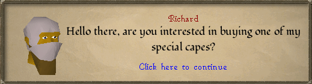

Glegoo

Lato

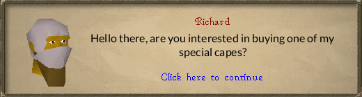

Morris Roman

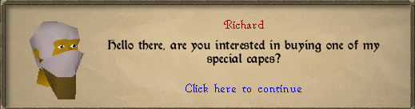

PT Serif

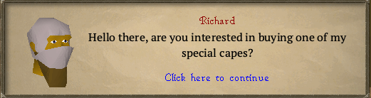

Roboto

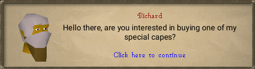
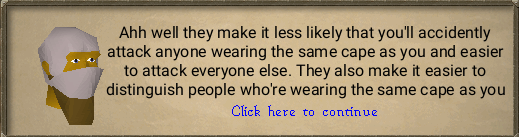

Runescape

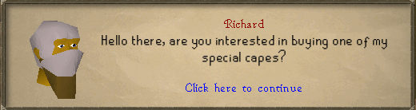

Runescape Bold

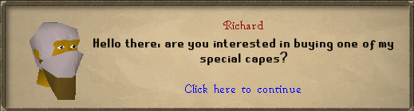

Sanchez

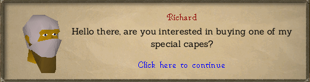

Ubuntu Light

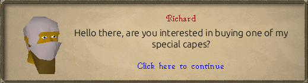
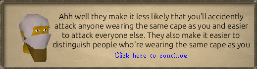

### Notes

This is my first RuneLite plugin and first Java project, so I welcome any and all feedback. My approach is pretty unsophisticated - I hide the NPC/User dialog widget and replace it with a new graphics layer. As such, the plugin does not alter any dialog choice menus

### Known Issues

- Clipping can occur with some fonts set at certain sizes. 
- If the "Hide NPC Name" config option is disabled and the dialog text is four lines long, the dialog text can collide with the NPC name depending on the font selected.

### Contributing

- If any issues are encountered, please open a new issue.
- Pull requests for new features and bugfixes are welcome. 

### Roadmap

- Explore adding background color options and/or modifying the dialog widget background hue.
- Add more font options.